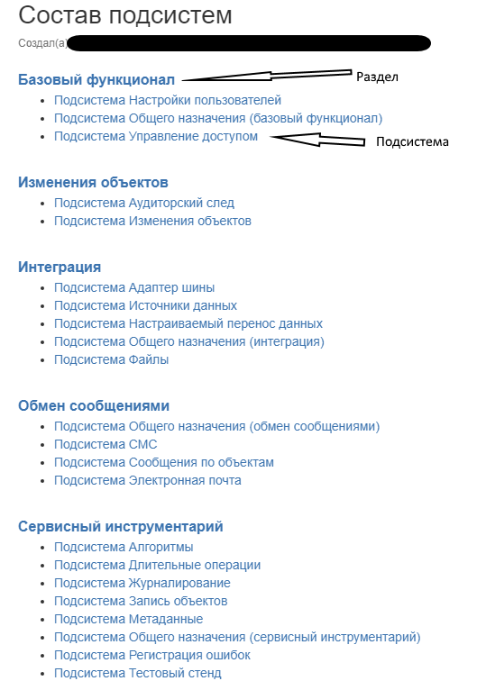
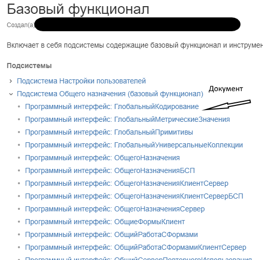
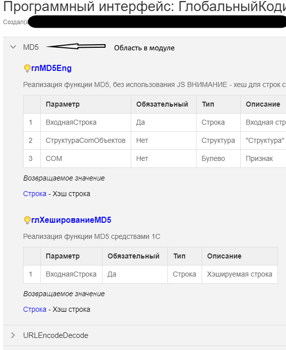
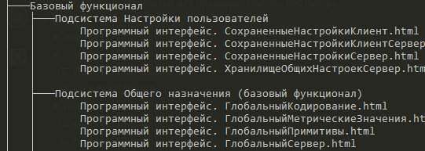
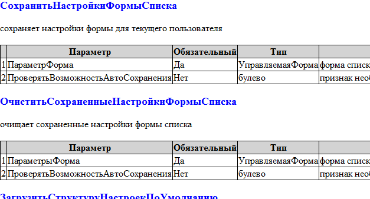

# AutodocGen

Инструмент генерации документации на основании файлов исходных кодов конфигурации 1С:Предприятие.

## Об инструменте

Инструмент позволяет

- автоматически сформировать документацию на основании исходных файлов конфигурации 1С:Предприятие
- выполнить проверку на возможность корректного разбора информации, выступающей исходными данными для документации
- опубликовать сгенерированную документацию

## Установка

Процесс установки стандартен:

- либо `opm install autodocgen`
- либо, если по разным причинам первый способ не подходит, то скачать архив из релизов, распаковать и выполнить (для windows) `installlocalhost.bat`

## Использование

Основные возможности есть в справке. Отдельно стоит обратить внимание на конфигурационный файл.

Конфигурационный файл соответствует структуре единого конфигурационного файла, ниже приведен пример

```json
    {
        "GLOBAL": {
            "КаталогИсходныхФайлов": "src\\configuration",
            "version": "1.0.3"
        },
        "AutodocGen":{
            "НастройкиConluence": {
                "АдресСервера":"https://my-confluence.myhost.ru",
                "Пользователь":"user",
                "Пароль":"password",
                "Пространство":"key",
                "КорневаяСтраница":"Имя кореневой страницы в пространстве key",
                "ПутьКШаблонам": "",
                "АнализироватьТолькоПотомковПодсистемы": "МояКорневаяПодсистема"
            },
            "НастройкиHTML": {
                "ПутьКШаблонам": "",
                "КаталогПубликации": "./doc",
                "АнализироватьТолькоПотомковПодсистемы": "МояКорневаяПодсистема"
            },
            "ПоследнийОбработанныйКоммит": ""
        }
    }
```

Располагать конфигурационный файл нужно в корне репозитория под именем `v8config.json`.

## Поддерживаемые варианты генерации автодокументации

Как видно из пример конфигурационного файла, поддерживаются 2 формата (ключ `-format`)

- `confluence` - генерация страниц в указанном пространстве [confluence](https://ru.atlassian.com/software/confluence)
- `html` - генерация структуры каталогов в соответствии с подсистемами и файлов-страниц в каталогах.

Для добавления новых стоит воспользоваться шаблоном [src/Классы/ШаблонГенераторДокументации.os-template](src/Классы/ШаблонГенераторДокументации.os-template)

## Подготовка конфигурации

Для генерации документации конфигурация должна соответствовать требованиям:

- Все модули должны иметь определенную структуру областей (в соответствии с требованиями 1С)
- В документацию добавляются только экспортные методы, находящиеся в разделе `ПрограммныйИнтерфейс`
- Описание методов должно соответствовать требованиям оформления кода
- Поддерживаются общие модуи и модули менеджеров объектов
- Все модули / объекты, которые попадают под правила автодокументирования, должны располагаться в соответствующих подсистемах. Принятая структура:

```

    Подсистемы конфигурации
    |
    +-- МояКорневаяПодсистема (не выводится в интерфейс пользователя)
        |
        +-- Раздел
            |
            +-- Подсистема
                |
                +-- ОбъектМетаданных

```

## Примеры

### В формате Confluence







### В Формате HTML




